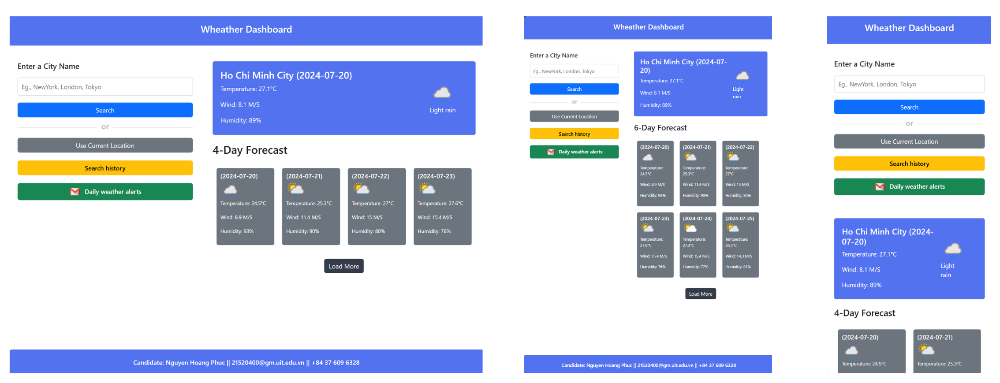
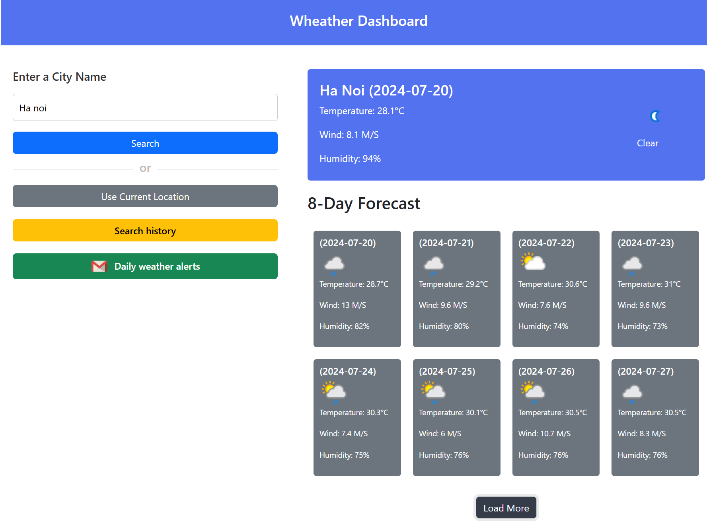
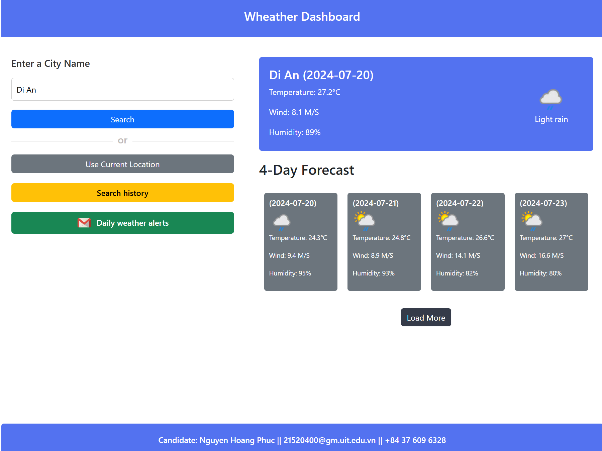
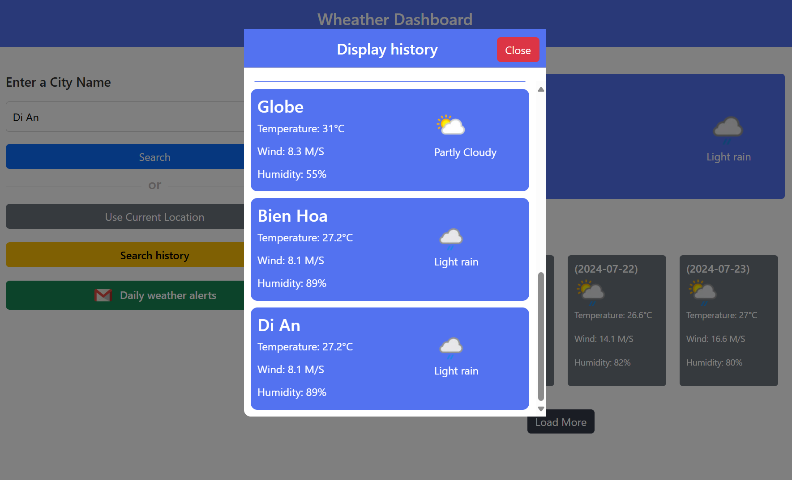
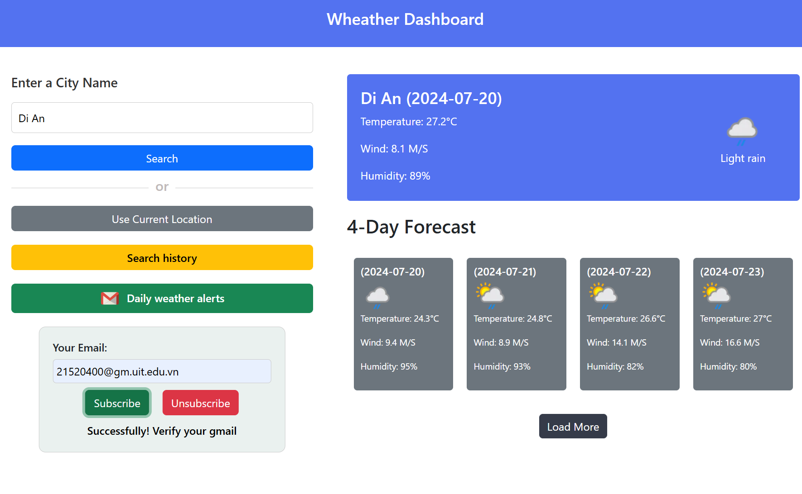
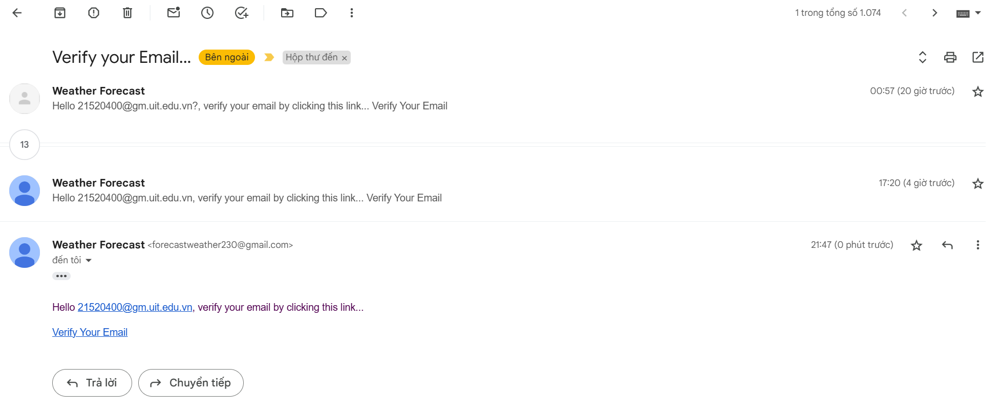
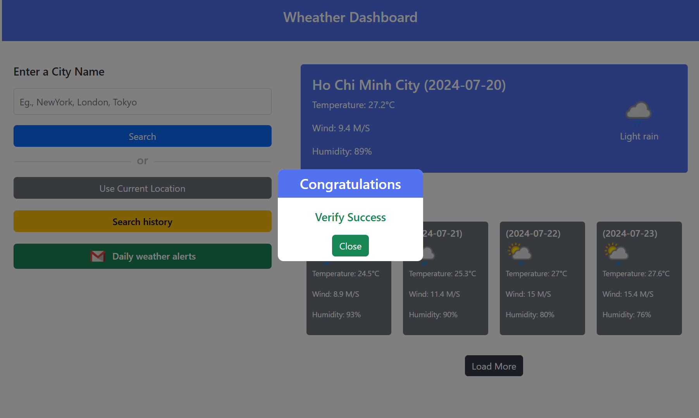
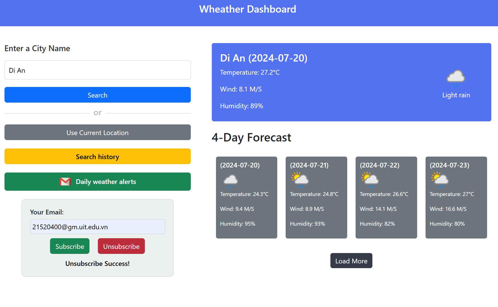

# Project Introduction

Dear GOLDEN OWL,

My name is Nguyen Hoang Phuc, a 4th-year student at the University of Information Technology - VNUHCM UIT. I am pleased to present my result for the web developer intern assignment. I have built a weather forecast website with a responsive design (tablet and mobile). [Visit my app](https://weather-forecast-frontend-smoky.vercel.app/)
* The website uses services from the API provider https://www.weatherapi.com (for weather forecasts) and from  https://openweathermap.org (for obtaining the current location).
* Use the deployment providers https://vercel.com for the client and https://dashboard.render.com for the server.
* Regarding deploying the server in render, the server will be inactive after 15 minutes in the free version. Therefore, when accessing the website and not seeing the data displayed, press the Load More button or enter the location and click Search. Then, wait about 10 seconds for the server to come back online




## Technologies Used

- **Frontend**: React, Redux Toolkit, Bootstrap
- **Backend**: NodeJS, ExpressJS
- **Database**: MongoDB

# Features of the Website
- **Search**: View weather forecasts at the search location
- **Use Current Location**: Get current location information and allow searching for the weather forecast 
- **Search History**: See the positions searched today
- **Daily Weather Alerts**: Subscribe and unsubscribe to receive daily weather update emails (verify with token)

# Demo of Some Interfaces
- Search Feature


- Use Current Location Feature



- Search History Feature



- Subscribe Feature




- Unsubscribe Feature


# Installation Guide
## Prerequisites
- Node.js
- npm or yarn
- MongoDB (local or cloud instance)

### Frontend Setup
1. **Clone the repository and navigate to the client directory:**
   ```bash
   git clone https://github.com/hoangphucseiza/WeatherForecast
   cd /WeatherForecast/client
   
2. **Install dependencies:**
   ```bash
   npm install
3. **Open the file src/utils/apiURL.js and update the apiURL variable as follows:**
   ```bash
   export const apiURL = 'http://localhost:5000';

4. **Start the client frontend server:**
   ```bash
   npm start
### Backend Setup
1. **Navigate to the backend directory and Install dependencies:**
   ```bash
   cd /WeatherForecast/client
   npm install
   
2. **Open the file services/EmailService.js and update the IP variable as follows:**
   ```bash
   const IP = 'http://localhost:3000';

3. **Start the client backend server:**
   ```bash
   npm start
